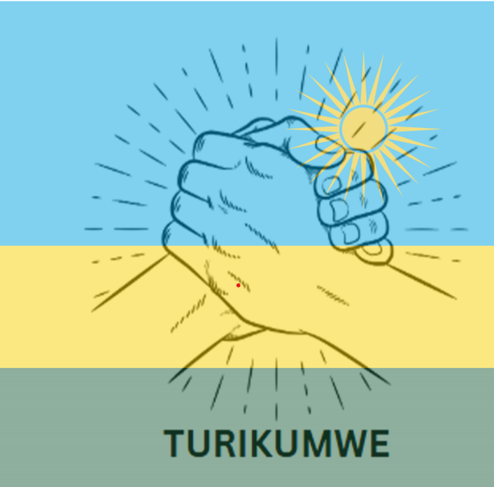

# Turikumwe - Rwandan Community App



Turikumwe ("We are together" in Kinyarwanda) is a mobile application designed to unite Rwandans by connecting people across districts and backgrounds. The app enables users to join groups, share ideas, and collaborate on community projects that drive positive change.

## Features

### Core Features
- **Groups**: Join interest-based groups to collaborate on community projects
- **Events**: Discover and RSVP to community events happening in your district
- **Posts**: Share updates, ideas, and seek assistance from your community
- **Stories**: Share inspiring stories of unity and success
- **Direct Messaging**: Connect privately with other community members
- **User Profiles**: Personalized profiles showing activities and contributions

### Additional Features
- **Multi-language Support**: Available in English, Kinyarwanda, and French
- **Dark Mode**: Comfortable viewing experience in low-light conditions
- **Offline Support**: Basic functionality available without internet connection
- **Admin Tools**: Content moderation and community management features

## Screenshots

<div style="display: flex; flex-wrap: wrap; gap: 10px; justify-content: center;">
    
    
    
    
</div>

## Technology Stack

- **Framework**: Flutter for cross-platform development
- **Database**: SQLite for local data storage
- **State Management**: Provider pattern
- **Authentication**: Secure local authentication with encryption
- **UI Components**: Custom Material Design components with Rwandan-inspired themes

## Project Structure

```
turikumwe/
│
├── android/          # Android specific configuration
├── ios/              # iOS specific configuration 
├── lib/              # Main application code
│   ├── constants/    # App constants (colors, strings, etc.)
│   ├── models/       # Data models
│   ├── screens/      # App screens
│   ├── services/     # Services (auth, database, etc.)
│   ├── utils/        # Utility functions
│   ├── widgets/      # Reusable widgets
│   └── main.dart     # Entry point of the application
│
├── assets/           # App assets
│   ├── fonts/        # Custom fonts
│   ├── images/       # App images
│   └── animations/   # Lottie animations
│
├── test/             # Test files
└── pubspec.yaml      # Flutter dependencies
```

## Getting Started

### Prerequisites
- Flutter SDK (2.10.0 or later)
- Dart (2.16.0 or later)
- Android Studio / VS Code with Flutter extensions
- Android SDK or iOS Development tools

### Installation

1. Clone the repository
```bash
git clone https://github.com/etienne0114/turikumwe.git
cd turikumwe
```

2. Install dependencies
```bash
flutter pub get
```

3. Run the app
```bash
flutter run
```

### Building for Production

#### Android
```bash
flutter build apk --release
```

#### iOS
```bash
flutter build ios --release
```

## Database Schema

The app uses SQLite for local data storage with the following structure:

### Tables
- **users**: User accounts and profiles
- **posts**: Community posts and updates
- **comments**: Post comments
- **groups**: Community interest groups
- **group_members**: Group membership junction table
- **events**: Community gatherings and activities
- **stories**: Success stories and impact reports
- **messages**: Direct and group messages
- **notifications**: System and user notifications

## Contributing

We welcome contributions from the community! To contribute:

1. Fork the repository
2. Create a feature branch (`git checkout -b feature/amazing-feature`)
3. Commit your changes (`git commit -m 'Add some amazing feature'`)
4. Push to the branch (`git push origin feature/amazing-feature`)
5. Open a Pull Request

See [CONTRIBUTING.md](CONTRIBUTING.md) for more details.

## Roadmap

- **Phase 1**: Core social features and community building (Current)
- **Phase 2**: Enhanced discovery and regional connections
- **Phase 3**: Expanded project collaboration tools
- **Phase 4**: Resource sharing marketplace
- **Phase 5**: Integration with public services

## License

This project is licensed under the MIT License - see the [LICENSE](LICENSE) file for details.

## Acknowledgments

- All contributors and community members
- Rwandan community organizations that provided feedback and guidance
- Flutter community for excellent plugins and support

---

Made with ❤️ for the people of Rwanda